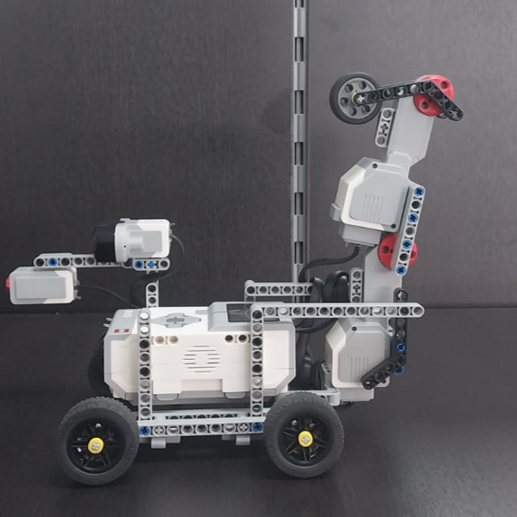
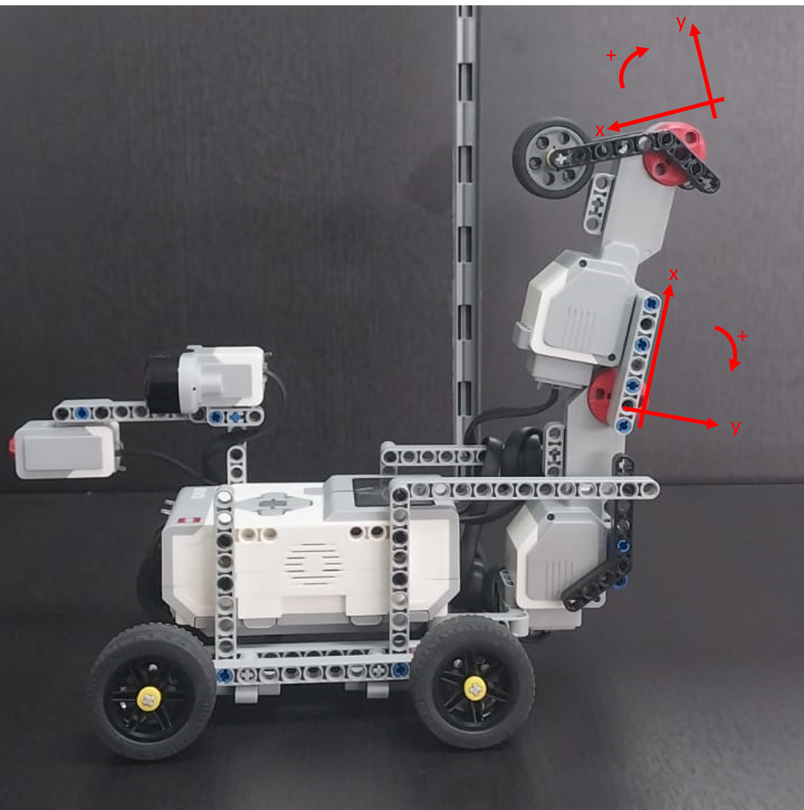

# Manual de Usuario del Proyecto Q-Learning con MindStorm EV3

Este repositorio contiene un proyecto que utiliza el algoritmo de DQN con buffer experience replay para entrenar y controlar un robot utilizando el Kit MindStorm EV3 de Lego, con el fin de que aprenda a desplazarse hacia delante. El proyecto también hace uso de la Toolbox MindstormsEV3 para interactuar con el hardware. Este manual de usuario proporciona instrucciones detalladas sobre cómo configurar, entrenar y probar el robot con este proyecto.

## Requisitos Previos

Para el correcto funcionamiento es necesario tener los siguientes requisitos previos configurados:

- Kit MindStorm EV3 de Lego.
- MATLAB instalado en tu computadora.
- Toolbox MindstormsEV3, se puede obtener desde el link: https://github.com/Markay12/mindstormsEV3/tree/master

## Construcción de robot

Los detalles para construir el robot para este proyecto están disponibles dentro de la carpeta [construction](./Construction/robotproximationdistance.pdf), además se incluye un archivo de diseño realizado en la plataforma EV3 Classroom App de Lego®.

## Información de Sensores

Puerto Sensor 1: Sensor Ultrasónico
Puerto Sensor 2: Sensor Táctil
Puerto Sensor 3: N/A
Puerto Sensor 4: N/A
Motores conectados en los puertos A y B

## Estado inicial

Para poder empezar el entrenamiento y testeo es necesario establecer un estado 0 en ambos motores, como se muestra a continuación:

## Entrenamiento

Para configurar el proyecto en su entorno, siga los siguientes pasos:
1. Encienda el Kit MindStorm EV3.
2. Establezca comunicación entre el Kit MindStorm EV3 de Lego y el software Matlab, en este caso se hizo uso de conexión USB.
3. Para empezar el entrenamiento, ejecute el archivo QNN_train.m.
   1. options: Configure los hiperparámetros que considere convenientes, como el número de neuronas por capas, funciones de transferencia, número de épocas, número de épocas para actualizar el momentum, gamma, epsilon, thao, tamaño máximo de buffer, número de batches y número de actualizaciones por batch.
   2. agent: Establezca los parámetros relacionados a los motores, como límites, velocidad y ángulos.
   3. trainQNN.m: Este archivo ubicado dentro de la carpeta QNN Toolbox se utiliza para entrenar una red neuronal que controla un robot en un entorno. En cada época de entrenamiento, el agente interactúa con el entorno, actualiza una memoria de experiencia y utiliza esta experiencia para ajustar los pesos de la red neuronal. El proceso se repite durante múltiples épocas, con la disminución gradual de la exploración (epsilon) y la visualización de métricas de entrenamiento. La función devuelve los pesos entrenados de la red neuronal al final del entrenamiento, lo que permite al agente tomar decisiones más informadas en el entorno.

### Simulación

Para ejecutar una simulación de entrenamiento y prueba, se hace uso de los archivos dentro de la carpeta Simulator Toolbox QNN_train_s y QNN_test_s, respectivamente.

## Testeo

Para probar el robot entrenado, siga estos pasos:
1. Ejecute el script de prueba QNN_test.m.
   1. net: Esta variable se utiliza para cargar el modelo entrenado.
   2. testQNN_robot.m: Este archivo ubicado dentro de la carpeta QNN Toolbox se utiliza para llevar a cabo la fase de prueba. En esta fase, el agente utiliza la red neuronal entrenada para tomar decisiones en un entorno específico (en este caso, un robot). La función comienza con la configuración inicial del agente y el entorno, y luego entra en un bucle en el que el agente toma decisiones basadas en los valores Q calculados por la red neuronal. El agente interactúa con el entorno, selecciona acciones y registra las transiciones de estado hasta que se cumplan ciertas condiciones de finalización, como alcanzar un estado terminal o un número máximo de pasos. Durante el proceso, se imprime información relevante, como los estados actuales y nuevos y la distancia recorrida.